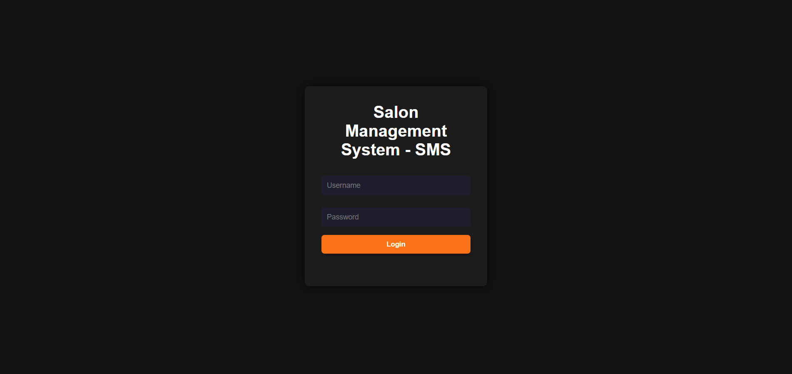
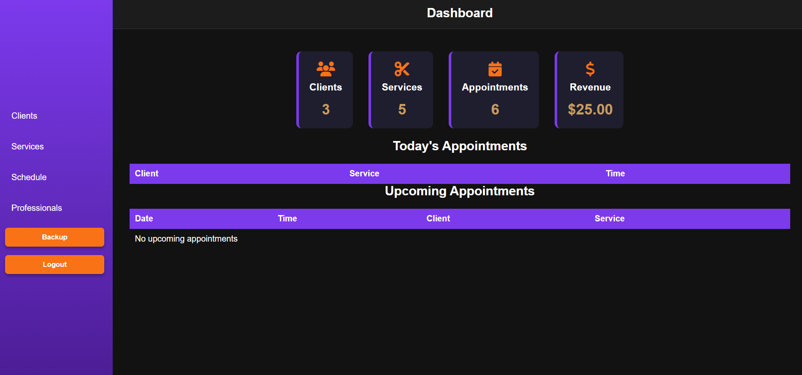
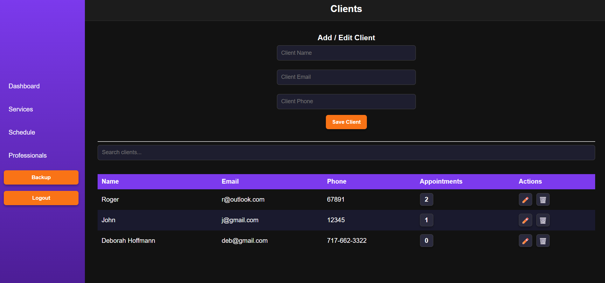
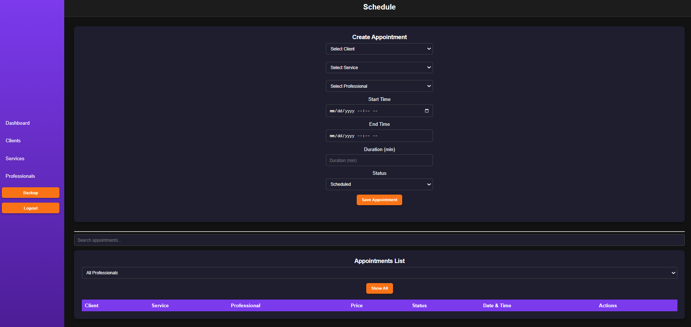

# Salon Management System

A web-based salon management system designed to manage clients, services, professionals, and appointments.

## Features

- Client management
- Service management
- Professional management
- Appointment scheduling
- Appointment status tracking
- Client appointment history
- Professional schedule filtering
- Revenue tracking
- Data backup and export
- Login and logout

## Technologies

- HTML5
- CSS3
- JavaScript
- LocalStorage
- Node.js
- Git & GitHub

## Project Overview

Salon Management System is a portfolio project focused on managing the daily operations of a salon. It allows users to manage clients, services, professionals, and appointments through a simple and responsive interface.

## How to Run

1. Clone the repository.
2. Open the project folder in VS Code.
3. Install the dependencies:
   `npm install`
4. Open `index.html` using Live Server.

## Screenshots

### Login

### Dashboard

### Clients

### Schedule

## Future Improvements

- User roles and permissions
- Online appointment booking
- Database integration
- Cloud data storage

## Author

Roger Amaral Hinkle

[GitHub](https://github.com/rahinklee)
